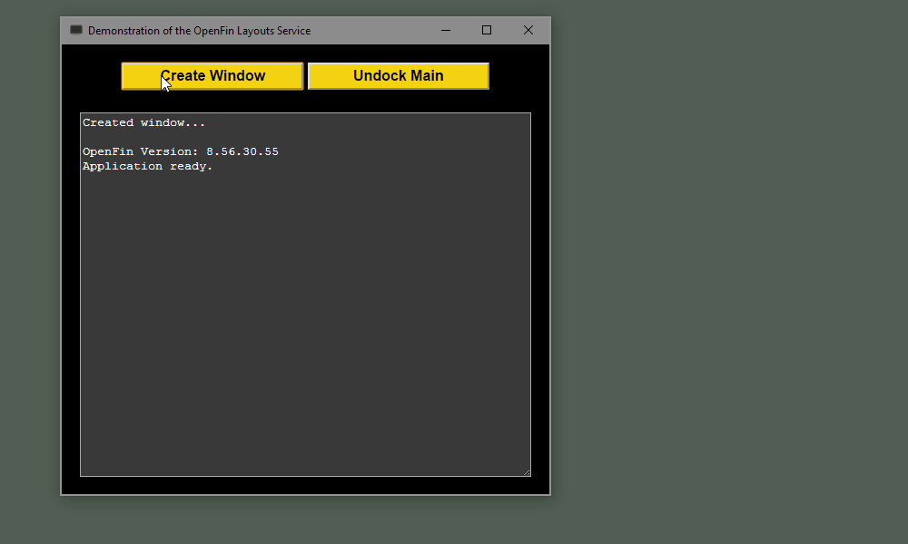

This project is a simple demonstration of the new Window Layout API provided by OpenFin:

At the time of this writing it is still a work-in-progress.  Documentation on what is available can be found here:

<a 
    href="https://github.com/HadoukenIO/layouts-service/blob/develop/docs.md" 
    target="_blank">
    https://github.com/HadoukenIO/layouts-service/blob/develop/docs.md
</a>

To start the application, first make sure to do a package install by running

    npm install

in the command line.  Once complete, the web server can be started with 

    npm start

or simply press F5 if in Visual Studio Code.  Then, to start openfin execute 
    
    npm run openfin

which will launch the application via the CLI.

To use, press the create the window button to generate a new instance and simply move it close enough to the edge of the main window to dock.  Dragging either window will take the other window with it.  Use the Undock button in either window to detach and drag independently again.

The deregister button will turn off docking for that instance of the child window:

